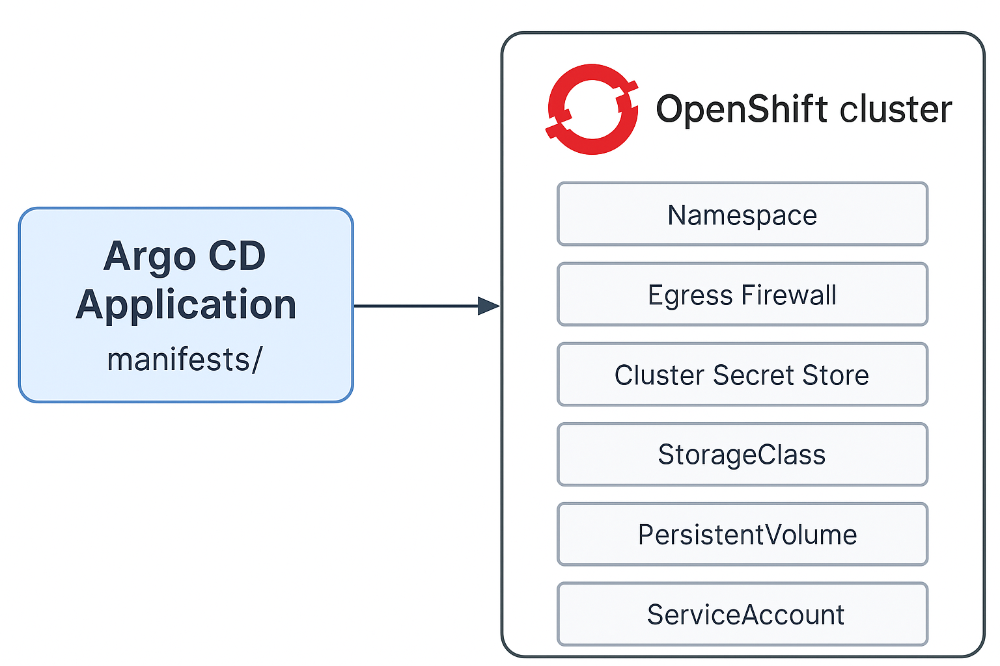

# Argo CD OpenShift Infrastructure Bootstrap

This repository provides the necessary YAML manifests to bootstrap foundational infrastructure components in an **OpenShift** cluster using **Argo CD**.

## Components Deployed

The following resources will be automatically created in your OpenShift cluster:

- Namespace (`sample-namespace`)
- Egress Firewall (deny all egress traffic except to `198.x.x.x/8`)
- Azure-based Cluster Secret Store (using CSI provider)
- StorageClass (Azure Disk)
- PersistentVolume (static provisioned)
- PersistentVolumeClaim
- ServiceAccount

## Repository Structure
 ├── manifests/ │ ├── clustersecretstore.yaml │ ├── egress-firewall.yaml │ ├── namespace.yaml │ ├── persistentvolume.yaml │ ├── persistentvolumeclaim.yaml │ ├── serviceaccount.yaml │ └── storageclass.yaml ├── project1-argocd-appln.yaml └── README.md

 
## How to Deploy with Argo CD on OpenShift

1. **Deploy the Argo CD Application resource** to OpenShift:
   ```bash
   oc apply -f project1-argocd-appln.yaml
   
2. Verify that the Argo CD app appears in the Argo CD UI or with:
   ```bash
   oc get applications -n argocd

3. Argo CD will:
   - Clone this GitHub repo
   - Sync resources from manifests/
   - Create the namespace and all other infra components

## Prerequisites
- Argo CD is installed in the OpenShift cluster
- Your GitHub repo is accessible to the Argo CD controller
- The disk and key vault (Azure resources) already exist for use in PV and ClusterSecretStore
- You have updated placeholder values like <your-keyvault-name>, <sub-id>, <rg-name> in the manifests

## 🖼️ Architecture Diagram

